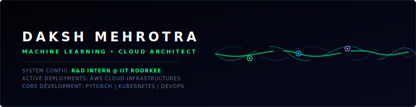
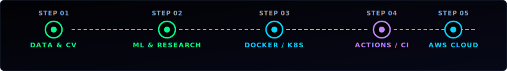

<!-- Animated Futuristic Header -->

 

<!-- Social & Badges Row -->

  

<!-- Profile Access Stats -->

---

## 📡 SYSTEMS DIAGNOSTICS (ABOUT ME)

<table width="100%">
  <tr>
    <td width="55%" valign="top">
      <h3>🧑‍💻 Profile Overview</h3>
      
I'm <b>Daksh Mehrotra</b>, a Cloud &amp; Machine Learning Engineer pursuing a B.Tech in Computer Science &amp; Engineering at UPES Dehradun. Currently executing advanced research as a <b>Nanoelectronics R&amp;D Intern at IIT Roorkee</b>.

      <ul>
        <li>🌐 <b>Base Locator:</b> Dehradun, Uttarakhand, India</li>
        <li>🎓 <b>Academic Track:</b> B.Tech CSE @ UPES Dehradun</li>
        <li>⚡ <b>Core Engine:</b> Designing and scaling intelligent Cloud, ML, and DevOps architectures</li>
        <li>🎯 <b>Current Thread:</b> Deepening knowledge in Distributed Systems and System Design</li>
        <li>🤝 <b>Mission:</b> Open to high-impact internships, R&amp;D roles, and tech collaborations</li>
      </ul>
      
<i>"If I am offline, I am sleeping."</i> 🖥️💤

    </td>
    <td width="45%" valign="top">
      <h3>🏆 Systems Milestones</h3>
      <ul>
        <li>🥇 <b>IBM ICE DAY:</b> Runner-Up position</li>
        <li>🧠 <b>ACM Leadership:</b> Secretary @ UPES ACM &amp; Head of Events @ UPES ACM-W</li>
        <li>🎯 <b>Community Outreach:</b> Organized 15+ tech events reaching 2400+ developers</li>
        <li>🧩 <b>Problem Solving:</b> 150+ LeetCode problems (Badges: 50 &amp; 100 days)</li>
        <li>💼 <b>Unstop Ambassador:</b> Campus representative driving developer engagement</li>
      </ul>
    </td>
  </tr>
</table>

---

## 🛠️ PIPELINE ORCHESTRATION (ML & DEVOPS LIFE-CYCLE)

  

---

## 🧬 TECH MATRIX

<table width="100%">
  <tr>
    <td width="50%" valign="top">
      <h4>🧠 Machine Learning &amp; Data Science</h4>
      
      
      
      
      
      
    </td>
    <td width="50%" valign="top">
      <h4>☁️ DevOps &amp; Cloud Infrastructure</h4>
      
      
      
      
      
      
    </td>
  </tr>
  <tr>
    <td width="50%" valign="top">
      <h4>💻 Languages &amp; Core Systems</h4>
      
      
      
      
    </td>
    <td width="50%" valign="top">
      <h4>🛠️ Databases &amp; Tooling</h4>
      
      
      
      
    </td>
  </tr>
</table>

---

## 🚀 FEATURED SOLUTIONS

<table width="100%">
  <tr>
    <td width="50%" valign="top">
      <h3>👁️ NETRA</h3>
      
<b>Emergency-aware smart traffic system</b> using YOLOv8 &amp; Graph Neural Networks (GNN) to dynamically optimize traffic signals for emergency response vehicles.

      <code>Python</code> <code>YOLOv8</code> <code>GNN</code> <code>NetworkX</code>
        
      <a href="https://github.com/DakshMehrotra" target="_blank"><b>View Project ➔</b></a>
    </td>
    <td width="50%" valign="top">
      <h3>🛡️ Rakshaka</h3>
      
<b>ML-driven cybersecurity intrusion detection</b> pipeline capable of analyzing network traffic anomalies and predicting intrusions in real-time.

      <code>Python</code> <code>Machine Learning</code> <code>Pandas</code> <code>Scikit-Learn</code>
        
      <a href="https://github.com/DakshMehrotra" target="_blank"><b>View Project ➔</b></a>
    </td>
  </tr>
  <tr>
    <td width="50%" valign="top">
      <h3>📦 ShipStack</h3>
      
<b>Zero-touch CI/CD pipeline</b> automating application containerization, testing, and deployment to AWS EC2 instances with zero-downtime rolling updates.

      <code>Docker</code> <code>GitHub Actions</code> <code>AWS</code> <code>Nginx</code>
        
      <a href="https://github.com/DakshMehrotra" target="_blank"><b>View Project ➔</b></a>
    </td>
    <td width="50%" valign="top">
      <h3>☁️ CloudNova</h3>
      
<b>Intelligent AWS resource optimizer</b> leveraging serverless technologies and cost anomaly detection algorithms to dynamically scale down idle resources.

      <code>Python</code> <code>Boto3</code> <code>AWS Lambda</code> <code>CloudWatch</code>
        
      <a href="https://github.com/DakshMehrotra" target="_blank"><b>View Project ➔</b></a>
    </td>
  </tr>
  <tr>
    <td width="50%" valign="top">
      <h3>🎭 FaceDetect</h3>
      
<b>Real-time face detection system</b> optimized to maintain high accuracy and robust identification across varied contrast and challenging lighting conditions.

      <code>Python</code> <code>OpenCV</code> <code>Computer Vision</code>
        
      <a href="https://github.com/DakshMehrotra" target="_blank"><b>View Project ➔</b></a>
    </td>
    <td width="50%" valign="top">
      <h3>💰 ExpenseFlow</h3>
      
<b>Java Swing budget tracking dashboard</b> designed using clean Object-Oriented Programming (OOP) architectures for structured finance monitoring.

      <code>Java</code> <code>Swing GUI</code> <code>OOP Design</code>
        
      <a href="https://github.com/DakshMehrotra" target="_blank"><b>View Project ➔</b></a>
    </td>
  </tr>
</table>

---

## 📊 SYSTEM ANALYTICS (GITHUB MONITOR)

  <table width="100%" border="0" cellspacing="0" cellpadding="0">
    <tr>
      <td align="center" valign="top" width="50%">
        
      </td>
      <td align="center" valign="top" width="50%">
        
      </td>
    </tr>
    <tr>
      <td align="center" colspan="2" valign="top" width="100%">
         
        
      </td>
    </tr>
  </table>

---

## 🗃️ AWS CERTIFICATIONS CREDENTIAL VAULT

  
  
  
  

---

## 🔌 CONNECT WITH THE NODE

  
Initializing handshake... Connect with my developer interface:

  
  
  

